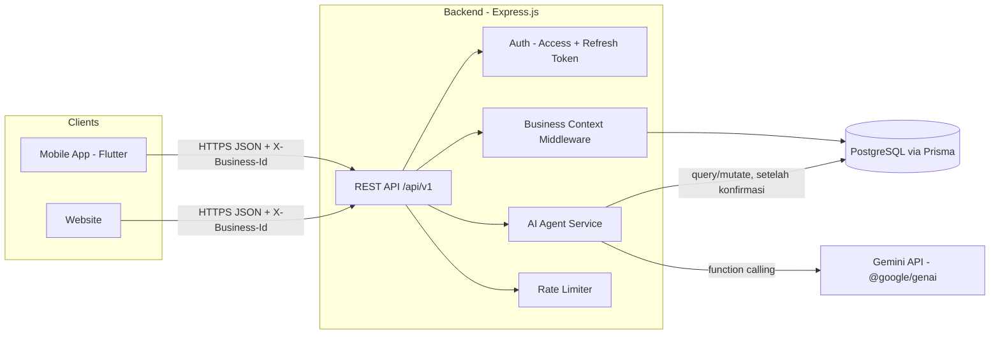

# Arsitektur Sistem — AIsistenku

## 1. Prinsip Utama

> **Satu backend, banyak client.** Semua logika bisnis, validasi, dan pemanggilan AI terjadi di backend (Express). Mobile app dan website adalah **presentation layer saja** — keduanya memanggil API yang sama persis, tidak ada logika bisnis yang di-duplikasi di masing-masing client.

Ini yang membuat mobile dan web "selaras": kalau ada perubahan aturan bisnis (misal validasi stok minimum), cukup diubah sekali di backend, otomatis berlaku untuk kedua platform.

> **Update penting**: backend sekarang multi-tenant (`Business` + `BusinessMember`). Setiap request ke data domain (produk, stok, transaksi, keuangan, chat AI) selalu beroperasi dalam konteks satu bisnis aktif — lihat §6.2.

## 2. Diagram

## 3. Komponen

### 3.1 Mobile App (Flutter)
- Fokus: kasir, POS cepat, cek stok, chat AI di lapangan.
- Konsumsi API lewat HTTP client (dio/http), simpan JWT di secure storage.

### 3.2 Website
- Fokus: dashboard owner — grafik bisnis, riwayat lengkap, chat AI, generate konten promosi.
- Konsumsi API yang **sama** dengan mobile (lihat `API-CONTRACT.md`).

### 3.3 Backend (Express)
- Satu-satunya pihak yang bicara langsung ke database dan ke Gemini API.
- Menyimpan `GEMINI_API_KEY` sebagai env var server-side — **tidak pernah** dikirim ke client manapun.
- Semua endpoint di-versionkan di bawah `/api/v1`.

### 3.4 Database (PostgreSQL via Prisma)
- Skema di `DATA-MODEL.md` / `schema.prisma`.
- Satu database dipakai bersama oleh semua fitur (POS, stok, keuangan, AI).

### 3.5 AI Agent Service
- Modul di dalam backend yang membungkus pemanggilan Gemini + function calling.
- Detail penuh di `AI-AGENT.md`.

## 4. Alur Request Umum

1. Client kirim request ke `/api/v1/...` dengan header `Authorization: Bearer <access token>` **dan** `X-Business-Id: <businessId>` (untuk endpoint domain — lihat §6.2).
2. Middleware auth verifikasi access token, inject `req.user`.
3. Middleware business-context cek apakah ada baris `BusinessMember` untuk (`req.user.id`, `X-Business-Id`) — kalau tidak ada, tolak dengan `403`. Kalau ada, inject `req.businessId` dan `req.role` (OWNER/CASHIER).
4. Controller validasi input (disarankan pakai Zod) sebelum menyentuh Prisma.
5. **Setiap query/mutate WAJIB difilter `where: { businessId: req.businessId }`** (langsung atau lewat relasi) — ini satu-satunya penghalang antara data satu bisnis dengan bisnis lain, jadi tidak boleh diabaikan di controller manapun.
6. Response dalam format envelope standar (lihat `API-CONTRACT.md`).
7. Rate limiter (`RateLimiterFlexible`, tabel `rate_limiter_flexible`) membatasi terutama endpoint `/ai/*` agar biaya panggilan Gemini terkendali.

## 5. Alur Khusus AI Agent

1. Client kirim pesan chat ke `/api/v1/ai/chat`.
2. Backend kirim pesan + riwayat + daftar tools ke Gemini.
3. Gemini balas salah satu dari tiga bentuk:
   - **Teks biasa** (percakapan umum) → langsung diteruskan ke client.
   - **Function call read** (`get_sales`, `get_stock`, dst) → backend eksekusi query, kirim hasil balik ke Gemini, Gemini rangkai jadi jawaban natural.
   - **Function call write** (`add_stock`, `add_expense`) → backend simpan sebagai `ai_actions` berstatus `PENDING`, balas ke client berupa **permintaan konfirmasi** — belum menyentuh tabel `stock_items`/`finance_transactions`.
4. Client tampilkan dialog konfirmasi. Kalau user setuju → client panggil `/api/v1/ai/actions/:id/confirm` → backend baru eksekusi mutasi sungguhan + update `ai_actions.status = CONFIRMED`.
5. Untuk `generate_promo_content` — ini murni generatif, hasil langsung dikirim ke client tanpa alur konfirmasi (tidak mengubah data apapun). Kalau user memilih "Simpan" salah satu hasilnya, client baru memanggil endpoint terpisah untuk menyimpannya sebagai `MarketingContent` (status `SAVED`) — lihat `AI-AGENT.md`.
6. Semua query/tool call AI Agent (baik baca, tulis, maupun generatif) dijalankan dalam konteks `req.businessId` yang sama seperti request biasa (§6.2) — AI tidak pernah mengakses data lintas bisnis.

## 6. Autentikasi & Konteks Bisnis

### 6.1 Access + Refresh Token
- Auth sendiri (bukan Firebase Auth), pakai pola **access token (JWT, umur pendek) + refresh token (tersimpan di tabel `refresh_tokens`, umur panjang)**.
- `RefreshToken` menyimpan metadata perangkat (`browser`, `os`, `ipAddress`, `expiresAt`) — ini memungkinkan fitur "kelola perangkat login" dan revoke per-device di masa depan.
- Password di-hash dengan bcrypt/argon2 sebelum disimpan di `User.password` — **tidak pernah** disimpan plaintext.
- Saat access token kedaluwarsa, client memanggil endpoint refresh dengan refresh token untuk dapat access token baru, tanpa perlu login ulang.

### 6.2 Konteks Bisnis Aktif (multi-tenant)
Karena satu `User` bisa menjadi `BusinessMember` di banyak `Business`, access token **hanya membawa identitas user**, bukan bisnis yang sedang aktif. Bisnis aktif ditentukan per-request lewat header `X-Business-Id`:

1. Setelah login, client panggil `GET /businesses` untuk dapat daftar bisnis yang diikuti user.
2. User (atau otomatis kalau cuma punya satu bisnis) memilih satu — client simpan `businessId` terpilih secara lokal.
3. Semua request domain berikutnya menyertakan header `X-Business-Id` itu.
4. Backend **selalu** memverifikasi keanggotaan (`BusinessMember`) sebelum memproses — tidak boleh percaya begitu saja pada header dari client.

Ini yang membuat business switcher di UI (lihat `06-DESIGN-SYSTEM.md`) bisa langsung ganti konteks tanpa re-login — cukup ganti `businessId` yang disimpan di client dan header yang dikirim.

## 7. Environment Variables (dipakai backend)

| Variable | Keterangan |
|---|---|
| `DATABASE_URL` | Connection string PostgreSQL |
| `JWT_ACCESS_SECRET` | Secret untuk sign/verify access token |
| `JWT_REFRESH_SECRET` | Secret terpisah untuk refresh token (disarankan beda dari access secret) |
| `GEMINI_API_KEY` | API key Gemini, server-side only |
| `PORT` | Port server Express |

Lihat `07-ENGINEERING-CONVENTIONS.md` untuk daftar lengkap termasuk yang dipakai di sisi client (mis. `API_BASE_URL`).
