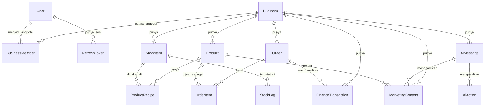

# Data Model — AIsistenku

Sumber kebenaran skema ada di `schema.prisma`. Dokumen ini menjelaskan **makna dan aturan bisnis** di baliknya, supaya siapapun (atau AI agent manapun) yang mengerjakan backend/web/mobile punya pemahaman yang sama soal data.

## 1. Konvensi

- **ID**: `String @default(uuid())` — UUID dibuat client-side oleh Prisma, disimpan sebagai kolom teks biasa (bukan native Postgres `uuid` type).
- **Penamaan tabel**: snake_case lewat `@@map` (mis. model `StockItem` → tabel `stock_items`).
- **Penamaan kolom**: **camelCase, sama persis dengan nama field** (tidak ada `@map` per-field) — jadi kolom di database bernama mis. `businessId`, `orderCode`, bukan `business_id`/`order_code`. Konsisten dipakai di semua model; kalau butuh raw SQL manual, ingat kolom-kolom ini perlu di-quote (`"businessId"`) karena bukan lowercase murni.
- **Enum**: semua field kategorikal (role, status, tipe) memakai Prisma `enum` agar type-safe dari sisi backend.
- **Timestamp**: `createdAt` selalu ada; `updatedAt` (`@updatedAt`) ada di entitas yang datanya berubah seiring waktu (`Business`, `Product`, `StockItem`, `MarketingContent`).

## 2. Entitas & Perannya

| Entitas | Peran |
|---|---|
| `Business` | Satu usaha/kedai — root dari semua data domain |
| `BusinessMember` | Keanggotaan `User` di `Business`, membawa `role` (OWNER/CASHIER) |
| `User` | Akun pengguna, auth sendiri (`password` = hash) |
| `RefreshToken` | Sesi login per-perangkat untuk pola access+refresh token |
| `Product` | Menu yang dijual, milik satu `Business` |
| `StockItem` | Bahan baku, milik satu `Business` |
| `ProductRecipe` | Bill of Materials — berapa `StockItem` dipakai per `Product` |
| `Order` / `OrderItem` | Transaksi POS |
| `StockLog` | Audit trail pergerakan stok |
| `FinanceTransaction` | Buku kas (income/expense) |
| `AiMessage` | Riwayat chat dengan AI |
| `AiAction` | Aksi terstruktur yang diusulkan AI, menunggu/sudah dikonfirmasi |
| `MarketingContent` | Ide caption/konten promosi yang dihasilkan AI dan (opsional) disimpan user |
| `RateLimiterFlexible` | Tabel infrastruktur untuk rate-limiting (dipakai paket `rate-limiter-flexible`, bukan entitas bisnis) |

## 3. Aturan Bisnis Kunci

### 3.1 Multi-tenant — setiap entitas domain terikat ke satu Business
`Product`, `StockItem`, `Order`, `FinanceTransaction`, `AiMessage`, `MarketingContent` semuanya punya `businessId`. **Setiap query dari backend wajib memfilter berdasarkan `businessId` milik user yang sedang login** (lihat `02-ARCHITECTURE.md` §6.2) — ini bukan sekadar kolom biasa, ini batas keamanan antar tenant. Lupa memfilternya = kebocoran data antar bisnis.

`StockLog` dan `OrderItem` tidak punya `businessId` langsung — scoping-nya lewat relasi (`StockLog.stockId → StockItem.businessId`, `OrderItem.orderId → Order.businessId`). Tetap harus di-join/filter dengan benar saat query.

### 3.2 Role per-bisnis, bukan global
Role (`OWNER`/`CASHIER`) ada di `BusinessMember`, bukan di `User`. Satu user bisa Owner di satu bisnis dan Kasir di bisnis lain. Setiap endpoint yang butuh cek izin (mis. hanya Owner boleh hapus produk) harus mengecek `BusinessMember.role` untuk kombinasi (user aktif, business aktif) — bukan atribut tetap di `User`.

### 3.3 Snapshot harga di transaksi
`OrderItem.productName` dan `OrderItem.priceAtSale` **disalin** dari `Product` saat transaksi dibuat, bukan di-reference live. Jangan pernah query harga historis lewat `Product.price` — selalu pakai `OrderItem.priceAtSale`.

### 3.4 Deduksi stok otomatis via resep
Saat `Order` dibuat dan `OrderItem` tersimpan: untuk setiap item, cari `ProductRecipe` milik produk tsb → kurangi `StockItem.currentStock` sesuai `quantityRequired × quantity` → catat `StockLog` dengan `source = ORDER_DEDUCTION`, `type = OUT`. Harus satu transaksi database (Prisma `$transaction`) supaya order dan pengurangan stok tidak pernah nyangkut separuh jalan.

### 3.5 Sumber setiap perubahan selalu tercatat
`StockLog.source` dan `FinanceTransaction.source` selalu diisi salah satu nilai enum-nya (`MANUAL`, `AI_AGENT`, `ORDER_DEDUCTION`, `RESTOCK`, `POS_AUTOMATIC`) — supaya owner bisa lihat mana perubahan yang dilakukan AI vs manual.

### 3.6 Siklus hidup `AiAction`
```
PENDING   → user belum merespons
CONFIRMED → user setuju, mutasi sungguhan sudah dieksekusi
CANCELLED → user tolak / batal, tidak ada perubahan data
```
Backend **tidak boleh** mengeksekusi mutasi (stok/keuangan) sebelum status berubah jadi `CONFIRMED`.

### 3.7 Siklus hidup `MarketingContent`
```
DRAFT    → baru dihasilkan AI, belum diputuskan user
SAVED    → user memilih menyimpan ke pustaka konten
ARCHIVED → sudah tidak relevan lagi (mis. promo sudah lewat), disembunyikan dari daftar utama tapi tidak dihapus
```
`sourceMessageId` (opsional) menautkan ke `AiMessage` asal permintaannya, untuk keperluan audit trail — boleh null kalau content dibuat lewat jalur lain di luar chat.

### 3.8 Soft-disable produk
`Product.isActive` dipakai untuk menyembunyikan produk dari menu POS tanpa menghapus row-nya (karena `OrderItem` historis mungkin masih mereferensikan `productId` tsb).

### 3.9 Kode transaksi unik per-bisnis, bukan global
`Order.orderCode` bersifat unik per `businessId` (`@@unique([businessId, orderCode])`), bukan unik lintas seluruh sistem — masing-masing bisnis boleh punya penomoran sendiri (mis. dua kedai berbeda sama-sama boleh punya `ORD-001`).

## 4. Relasi (ringkas)



## 5. Item Terbuka

- `MarketingContent` belum punya kolom `userId` langsung (hanya bisa ditelusuri lewat `sourceMessageId → AiMessage.userId`, yang bisa null). Kalau nanti butuh query cepat "konten yang disimpan si Kasir A", pertimbangkan tambah `userId` opsional langsung di `MarketingContent`.
- Alur undangan anggota tim (`BusinessMember`) belum didefinisikan — saat ini diasumsikan Owner menambahkan anggota secara manual (lihat Non-Goals di `01-PRD.md`).
